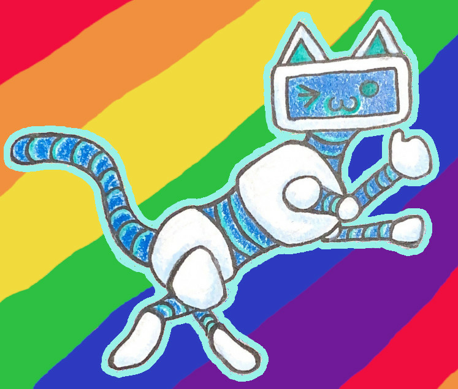

<div align="center">

</div>

# Kard-bot
[](https://github.com/TannerKvarfordt/Kard-bot/actions/workflows/go.yml)
[](https://github.com/TannerKvarfordt/Kard-bot/actions/workflows/codeql-analysis.yml)
[](https://github.com/TannerKvarfordt/Kard-bot/actions/workflows/release.yml)
[](https://goreportcard.com/report/github.com/TannerKvarfordt/Kard-bot)

A discord bot destined for greatness.

# Table of Contents
- [Kard-bot](#kard-bot)
- [Features](#features)
- [User Guide](#user-guide)
  * [Hosting Installation](#hosting-installation)
    + [Host using Docker](#host-using-docker)
      - [Prerequisites](#prerequisites)
      - [Instructions](#instructions)
    + [Building from source](#building-from-source)
      - [Prerequisites](#prerequisites-1)
      - [Instructions](#instructions-1)
  * [General Notes](#general-notes)
- [References](#references)
    + [Discord API Wrappers](#discord-api-wrappers)
    + [Documentation](#documentation)
    + [Tutorials](#tutorials)

<small><i><a href='http://ecotrust-canada.github.io/markdown-toc/'>Table of contents generated with markdown-toc</a></i></small>


# Features

- [x] Respond to user greetings and goodbyes
- [x] DnD dice roller
- [x] Copy-pastas
- [x] Reddit Roulette
- [x] [Uwu-ifier](https://lingojam.com/uwu-ify)
- [x] Print out a help message
- [x] Let users know when it is Wednesday
- [x] Daily compliments DM'd to users who opt in
- [x] Creepy DMs sent to users who opt in
- [x] Provide "odds" that a user specified event will occur
- [x] Build memes from provided templates and user provided text
- [ ] Inform users when Kard-bot is updated
- [ ] Mock certain questions or phrases
- [ ] "Quack" any time a user types an expletive
- [ ] Subscribe to social media accounts (maybe a webhook would be more appropriate?)
- [ ] Play music via youtube à la [rythm bot](https://rythm.fm/)
- [ ] Configurably replace words with other words
- [ ] Search and link to DnD wiki articles
- [ ] Allow users to query Google; provide direct links to top results and a link to all results
- [ ] Youtube Roulette

# User Guide

This bot is not publicly hosted anywhere. If you want to use it, you can always try [hosting it yourself](#hosting-installation)! :)

## Hosting Installation

Hosting this bot requires a Discord Bot Token. You can generate one by visiting the [Discord Developer Portal](https://discord.com/developers/applications),
and then creating a new application with an accompanying bot. Give the bot its needed permissions in the OAuth2 section **(Be sure to tick the "applications.commands" box!)**, and then invite it to your server(s) using the link that is generated for you.

Now that the bot is invited, you should see it as an offline user in your server. Now you only need to start the bot backend to bring it online! You have two options:
1. [Using the provided Docker images](#host-using-docker)
2. [Building from source](#building-from-source)

### Host using Docker
#### Prerequisites
- A host machine with one of the following system architectures:
  - arm64
  - amd64
  - arm/v7
- [Docker](https://www.docker.com/get-started)
- [docker-compose](https://docs.docker.com/compose/install/)

#### Instructions
Head over to the [Releases](https://github.com/TannerKvarfordt/Kard-bot/releases) page and download the tarball for the desired release.
These tarballs contain everything needed to get an instance of the bot up and running, provided that the host machine has internet access.
Untar it on the host machine. Edit the included `.env` file to include the bot token you generated earlier. You may also want to
set the time zone by setting the `TZ` variable.
```shell
KARDBOT_TOKEN="Your bot token here"
TZ="Your time zone here ex: America/Boise"
```
Next, edit the `slash-cmd-guilds` entry in the `config/setup.json` file to include the guild (server) IDs of each server you invited the bot to.

With your token in place and your config updated, you can simply run `docker-compose up -d` from the untarred directory to get your bot started!
The Docker daemon will automatically download the needed docker image from [Docker Hub](https://hub.docker.com/repository/docker/tkvarfordt/kardbot/) or the
[GitHub Container Registry](https://github.com/TannerKvarfordt/Kard-bot/pkgs/container/kard-bot). 
To check the status of the docker container, you can use `docker ps -a` or `docker logs <CONTAINER-NAME>`.

### Building from source
#### Prerequisites
- The [Go](https://golang.org/) 1.17 runtime or later.

#### Instructions
Assuming you have the [Go](https://golang.org/) runtime installed, you can install Kard-bot with a simple set of shell commands.

```shell
go get github.com/TannerKvarfordt/Kard-bot
cd $GOPATH/src/github.com/TannerKvarfordt/Kard-bot
go build
```

In order to authenticate with Discord, Kard-bot looks for the `KARDBOT_TOKEN` environment variable.
It is recommended to place that variable in a `.env` file at the root of the project. Note that existing
environment variables take precedence over anything in the `.env` file.

```shell
KARDBOT_TOKEN="Your bot token here"
```

You will also need to edit the `slash-cmd-guilds` entry in the `config/setup.json` file to include the guild (server) IDs of each server you invited the bot to.

With your token in place and your config updated, you can simply run the Kard-bot binary to bring it to life!
For a more robust running solution, consider creating a [systemd service](https://docs.fedoraproject.org/en-US/quick-docs/understanding-and-administering-systemd/#creating-new-systemd-services) or [using the provided Docker image](#host-using-docker).

## General Notes

Some commands are restricted so that only the bot owner can run them. The bot owner is specified by the `KARDBOT_OWNER_ID` environment variable.
It can be set in the same manner as the `KARDBOT_TOKEN` variable. Its value should be the user ID of the bot owner. Note that this is not the same
as the owner's username. The user ID is a unique ID assigned by Discord. You can retrieve it by enabling developer mode in your Discord client, right
clicking a user, and selecting "Copy ID".

# References

Useful resources for writing a Discord bot.

### Discord API Wrappers

- [discordpy](https://github.com/Rapptz/discord.py)
- [discordgo](https://github.com/bwmarrin/discordgo)
- [others](https://discordapi.com/unofficial/comparison.html)

### Documentation

- [Discord Developer Portal](https://discord.com/developers/docs/intro)

### Tutorials

- [Real Python Tutorial](https://realpython.com/how-to-make-a-discord-bot-python/)
